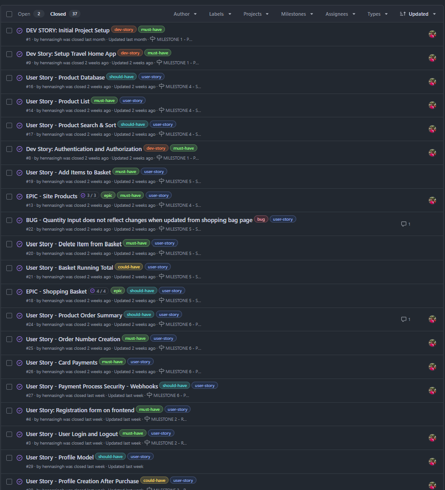

# TravelTableTop

Travel Table Top is an ecommerce MVP site that sells travel games sorted by age, min play time and different genres. The dataset is taken from Board Game Geek. The site is built using Django, Python, Postgres and AWS S3 bucket for the portfolio project 5 of Code Institute's Full Stack Development Diploma.


Live Link: https://travel-table-top-6a0c25007929.herokuapp.com/

## User Experience - UX

### Strategy

I love playing board and Card games. I always try to pack small games when I go travelling to either play solo or with friends/family. On my research I could not find a website that would sell just travel size games. You need to search a lot to find decent examples. Hence, that inspired me to create a website that would sell games just for travel and cater to age groups and genres.

#### User Stories

All user stories can be found in the linked [Github Project](https://github.com/users/hennasingh/projects/8)

### Scope

The user stories were broken into epics and milestones. I had a high-level plan for the project, and I followed Boutique Ado walkthrough to add ecommerce aspect to it. 

Overall, the site aims to provide variety of travel games for your road, airplane, train trips. The platform allows both signed in and anonymous checkout and provides profile management and order history.

Home Page - Introduction to Travel games
Product Page - List of variety of games
Login/Register - To maintain profile and order history, you have to create an account on the site.

### Skeleton

The site designs were generated with help from Claude. I made changes to the design as I progressed in actual development of the site.

<details>
<summary>Travel Table Top Design</summary>


</details>

### User Interface

#### Typography

I used the same font Lato as it was used in Boutique Ado Walkthrough

#### Colors

Color scheme suggestions were taken from Coolers on uploading an image from pexels.com

<details>
<summary>Color Palette</summary>


</details>

#### Database Schema


##### Models

1. User: The User model is part of Django Allauth. The model comes with predefined fields as standard. Some of them are username, email, name, password, and more. This model is used for user authentication, hence why changes directly to this model are not advisory. The User model is connected to the UserProfile model with one to one relationship.

2. UserProfile: The UserProfile model is a custom model to handle the user profile details. Signals are used to reflect the changes between the User and UserProfile models.

3. Category: This model was created for the purpose of defining categories for the products.

4. Product: This is a custom model for storing games. It is connected to Category as a Foreign Key. Different games can have different categories. In addition it has fields for min_play time, min_age, complexity, num_players, year of publishing and more.

5. Order: This model holds all the information of the user's order. It is connected to the UserProfile as a ForeignKey.

6. OrderLineItem: This model is connected to the Order and Product as a ForeignKey. It is created for each item in the order.

7. Contact: This is a standalone model that enables user to contact website admin.

8. FAQ: This is another standalone model with questions and answers a user may have about the website.

## Agile Methodology

Agile methodology was followed for building the complete site. User Stories were categorized in Epics and Milestones.

### EPICS => MILESTONES

I grouped user-stories in epics which were further grouped in Milestones. Some epics and milestones were added as I progressed with the app.


### MoSCoW Prioritization

I applied MoSCoW prioritization and labels to my user stories within the issues tab.

- **must-have**: guaranteed to be delivered
- **should-have**: adds significant value, but not vital
- **could-have**: small impact, but nice to have
- **wont-have**: not a priority for current version



### Github Projects

The Kanban board was created to keep track of different user stories and their progress. Columns such as backlog, in-progress, done, and fixed bugs were added to visualize the workflow.


### User Story Issues

The structure of user-story issue consisted of user story, acceptance criteria, and tasks required to complete the issue. Wherever possible, the commit messages were connected to corresponding issues.


## Site Features

## Future Implementations

1. I would like to add more varity of games and specific to travel medium :road, airplane, train.
2. I would like to add review model so that users can review their experience of playing the game.
3. I would like to add wishlist model so users can save list of games.
4. I would like to add a separate nav view for new games and special offers. 
5. I would like to add subscription fetaure where users that subscribe can both sell and buy games from the platform.
6. I would like to customize admin dashboard where admin can see a record of sales, inventory count and most bought games from
the platform

## Tools, Technologies and Languages

### Languages

- HTML
- CSS
- JavaScript
- Python
- Django

### Technologies and Programs

- [Git](https://git-scm.com/) used for version control. (git add, git commit, git push)
- [GitHub](https://github.com/) used for secure online code storage.
- [Bootstrap](https://getbootstrap.com/) used as the front-end CSS framework for modern responsiveness and pre-built components.
- [Django](https://www.djangoproject.com/) used as the Python framework for the site.
- [PostgreSQL](https://www.postgresql.org/) used as the relational database management.
- [Neon](https://neon.tech/) used as the Postgres database.
- [Psycopg2](https://pypi.org/project/psycopg2/) used as a PostgreSQL database adapter
- [Heroku](https://www.heroku.com/) used for hosting the deployed back-end site.
- [Stripe](https://stripe.com/) used for online secure payments of ecommerce products/services.
- [AWS S3](https://aws.amazon.com/s3) used for online static file storage.
- [Allauth](https://docs.allauth.org/en/latest/) used as the user authentication system
- [Pillow](https://pypi.org/project/Pillow/) used as the Python framework for the site.
- [Gunicorn](https://docs.gunicorn.org/en/stable/index.html) used for WSGI server
- [Crispy Forms](https://django-crispy-forms.readthedocs.io/en/latest/) used for auto-formatting of front-end forms

## Ecommerce Business Model

This site sells goods to customers, therefore follows a `Business to Customer` model. It is a simplest B2C forms, as it includes
one time payment, and doesn't need anything such as monthly/annual subscriptions.

It is a basic MVP site, with a newsletter and, facebook marketing page.

Promoting on social media can build a community of users around the business, and boost site visitor numbers, especially when using larger platforms such a Facebook.

A newsletter list can be used by the business to send regular messages to site users. For example, what items are on special offer, new items in stock, updates to business hours, notifications of events, and much more!

## Seach Engine Optimization (SEO) & Social Media Marketing

### Keywords

I identified some appropriate keywords that aligns with my site and when users search for travel games, the website
should appear in the search engine results. These included 2 kinds of keywords:

- Short-tail keywords
- Long-tail keywords#

I played around with [Word Tracker](https://www.wordtracker.com/) to check the frequency of some of my site's primary keywords and also turned the process of searching for keywords into an SEO article.


### Sitemap

I'have used [XML-Sitemaps](https://www.xml-sitemaps.com/) to generate a sitemap.xml file. This was generated using my deployed site URL: https://travel-table-top-6a0c25007929.herokuapp.com/

After it finished crawling the entire site, it created a [sitemap.xml](https://github.com/hennasingh/TravelTableTop/blob/main/sitemap.xml) which I've downloaded and included in the repository.

### Robots

I've created the [robots.txt](https://github.com/hennasingh/TravelTableTop/blob/main/robots.txt) file at the root-level. Inside, I've added the default settings:

```
User-agent: *
Disallow:
Sitemap: https://travel-table-top-6a0c25007929.herokuapp.com/sitemap.xml
```

#### Further links for future implementation:

- [Google search console](https://search.google.com/search-console)
- [Creating and submitting a sitemap](https://developers.google.com/search/docs/advanced/sitemaps/build-sitemap)
- [Managing your sitemaps and using sitemaps reports](https://support.google.com/webmasters/answer/7451001)
- [Testing the robots.txt file](https://support.google.com/webmasters/answer/6062598)

### Social Media Marketing

Creating a strong social base (with participation) and linking that to the business site can help drive sales. Social media platforms like Instagram, Facebook if managed properly can aid sales for the website.

I created a [mock facebook page](https://www.facebook.com/traveltabletop) for traveltable top business. (A screenshot added below in case facebook block the page)


### Newsletter Marketing

I embedded a newsletter sign-up form provided by mailchimp in my application, to allow users to input their email address if they are interested in learning more.


## Testing

For all testing, please refer to testing.md file

## Deployment

### Before Deployment

To ensure the application is deployed correctly on Heroku it is mandatory to update the requirements.txt. This is a list of requirements that the application needs in order to run.

To create the list of requirements we use the command `pip freeze > requirements.txt`. This will ensure the file with the requirements is updated.
Then commit and push the changes to GitHub.

! Before pushing code to GitHub ensure all credentials are in an `env.py` file, which is included in the `.gitignore` file. This tells Git not to track this file which will prevent it from being added to Github and the credentials being exposed.

### Amazon AWS

This project uses [AWS](https://aws.amazon.com/) to store media and static files online, due to the fact that Heroku doesn't persist this type of data.

Once you've created an AWS account and logged-in, follow these series of steps to get your project connected. Make sure you're on the **AWS Management Console** page.

#### S3 Bucket

- Search for S3.
- Create a new bucket, give it a name (matching your Heroku app name), and choose the region closest to you. 
- Under Block Public Access settings unselect block all public access as the application will need access to the objects in the bucket.
- Under **Object Ownership**, make sure to have ACLs enabled, and Bucket owner preferred selected.
- Create S3 bucket

#### Bucket Properties

- Open the bucket page.
- Go to properties tab and scroll down to website hosting and click on edit.
- Enable static website hosting
- Under the Hosting type section ensure Host a static website is selected.
- Add Index.html to index document field and error.html to error document field and click save.

#### Bucket Permissions

- Navigate and Click on the "Permissions" tab.
- Scroll down to the "CORS configuration" section and click edit.
- Enter the following snippet into the text box and click on save changes.
````
[
    {
        "AllowedHeaders": [
            "Authorization"
        ],
        "AllowedMethods": [
            "GET"
        ],
        "AllowedOrigins": [
            "*"
        ],
        "ExposeHeaders": []
    }
]
````
- Scroll to bucket policy section and click edit. Take note of the bucket arn (Example: arn:aws:s3:::test-bucket)
- Click on policy generator and set the following settings:

    - Select Type of Policy - S3 Bucket Policy
    - Effect Allow
    - Principal *
    - AWS Service Amazon S3
    - Actions: GetObject
    - Amazon arn: your arn from the previous page
- Click on add statement and then generate policy.Copy the policy
- Paste the policy into the bucket policy editor.
- Add "/*" to the end of the resource key to allow access to all resources in this bucket.
- Navigate and Click Save changes.
- For the Access control list (ACL) section, click edit and enable List for Everyone (public access) and accept the warning box. If the edit button is disabled, you need to change the Object Ownership section above to ACLs enabled (refer to Create Bucket section above).

#### IAM (Identity Access Management)

##### Create User group

- In the search bar, search for IAM.
- On the IAM page select user groups in the menu on the left.
- Click on create user group, add a name and click create group. The users and permission policies will be added later.

##### Permission policy for User group

- Go to Policies in the left-hand menu and click create policy
- Click on actions and import policy.
- Search for "AmazonS3FullAccess", select this policy, and click "Import".
- Click "JSON" under "Policy Document" to see the imported policy
- Copy the bucket ARN from the bucket policy page and paste it into the "Resource" section of the JSON snippet. Be sure to remove the default value of the resource key ("") and replace it with the bucket ARN. *Copy the bucket ARN a second time into the "Resource" section of the JSON snippet. This time, add "/" to the end of the ARN to allow access to all resources in this bucket*.
````
 {
 	"Version": "2012-10-17",
 	"Statement": [
 		{
 			"Effect": "Allow",
 			"Action": "s3:*",
 			"Resource": [
 				"arn:aws:s3:::your-bucket-name",
 				"arn:aws:s3:::your-bucket-name/*"
 			]
 		}
 	]
 }
````
- On the next page add polcity name and description and click create policy.

##### Attach Policy to User group

- Click on User Groups in the left-hand menu.
- Click on the user group name created during the above step and select the permissions tab.
- Click Attach Policy.
- Search for the policy created during the above step, select it and click attach policy.

##### Create User

- Click on Users in the left-hand menu and click on add user.
- Enter a User name .
- Select Programmatic access and AWS Management Console access and click next.
- Click on add user to group, select the user group created earlier and click create user.
- Take note of the Access key ID and Secret access key as these will be needed to connect to the S3 bucket.
- To save a copy of the credentials click Download .csv

#### Final AWS Setup

- If Heroku Config Vars has ``DISABLE_COLLECTSTATIC`` still, this can be removed now, so that AWS will handle the static files.
- Back within S3, create a new folder called: media.
- Select any existing media images for your project to prepare them for being uploaded into the new folder.
- Under Manage Public Permissions, select Grant public read access to this object(s).
- No further settings are required, so click Upload.

### Stripe setup

- Log in to [Stripe](https://stripe.com/en-ie)
- From your Stripe dashboard, click to expand the "Get your test API keys".
- You'll have two keys here:
    - STRIPE_PUBLIC_KEY = Publishable Key (starts with pk)
    - STRIPE_SECRET_KEY = Secret Key (starts with sk)

As a backup, in case users prematurely close the purchase-order page during payment, we can include Stripe Webhooks.

- From your Stripe dashboard, click Developers, and select Webhooks.
- From there, click Add Endpoint.
    https://your-app.herokuapp.com/checkout/wh/
- Click receive all events.
- Click Add Endpoint to complete the process.
- You'll have a new key here:
    - STRIPE_WH_SECRET = Signing Secret (Wehbook) Key (starts with wh)

### Deployment on Heroku

- To deploy the project on Heroku, first create an account.
- Once logged in, create a new app by clicking on the create app button
- Pick a unique name for the app, select a region, and click Create App.
- On the next page select the settings tab and scroll down to Config Vars. If there are any files that should be hidden like credentials and API keys they should be added here. In this project, there are credentials that need to be protected. This project requires credentials added for:
````
  1. Django's secret key
  2. Database Credentials
  3. AWS access key 
  3. AWS secret key
  4. Email host password.
  5. Stripe public key
  6. stripe secret key
  7. Stripe wh secret
````

- Scroll down to Buildpacks. The buildpacks will install further dependencies that are not included in the requirements.txt. For this project, the buildpack required is Python
- From the tab above select the deploy section.
- The deployment method for this project is GitHub. Once selected, confirm that we want to connect to GitHub, search for the repository name, and click connect to connect the Heroku app to our GitHub code.
- Scroll further down to the deploy section where automatic deploys can be enabled, which means that the app will update every time code is pushed to GitHub. Click deploy and wait for the app to be built. Once this is done, a message should appear letting us know that the app was successfully deployed with a view button to see the app.

### Creating a fork

- Navigate to the [repository](https://github.com/hennasingh/TravelTableTop)
- In the top-right corner of the page click on the fork button and select create a fork.
- You can change the name of the fork and add description
- Choose to copy only the main branch or all branches to the new fork.
- Click Create a Fork. A repository should appear in your GitHub

### Cloning Repository

- Navigate to the [repository](https://github.com/hennasingh/TravelTableTop)
- Click on the Code button on top of the repository and copy the link.
- Open Git Bash and change the working directory to the location where you want the cloned directory.
- Type git clone and then paste the link.
- Press Enter to create your local clone.

## Credits

### Media

- [Pexels](https://www.pexels.com/photo/colorful-cards-and-dice-8111264/) - Home Page Hero Image
- [Font-Awesome](https://fontawesome.com/search?ic=free) - social media icons
- [Coolers.co](https://coolors.co/) - for color scheme

### Content 

- [ChatGPT](https://chat.openai.com/) - Website Introduction
- [Claude](https://claude.ai/new) - Website Design
- [Board Game Geeks](https://boardgamegeek.com/geeklist/39248/bookgnomes-ultimate-travel-games-list) - Games images and details

### Code 

- Boutique Ado walkthrough 
- [Windsurf](https://windsurf.com/) - for help with footer alignment, FAQa and Contact us page

### Acknowledgements

- Huge thank you to my mentor Spencer Barriball for all the help and resources.
- The Code Institute facilitor Lewis and colleages

