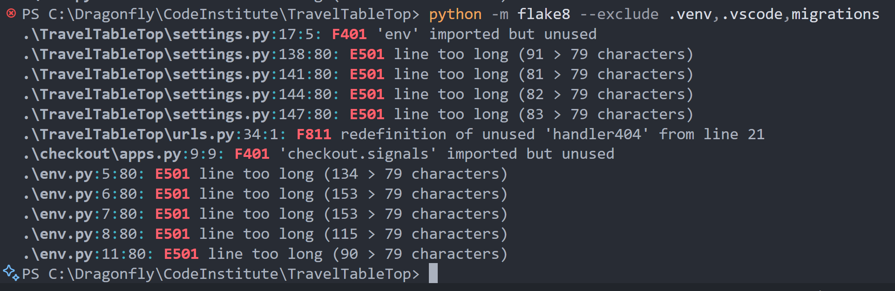
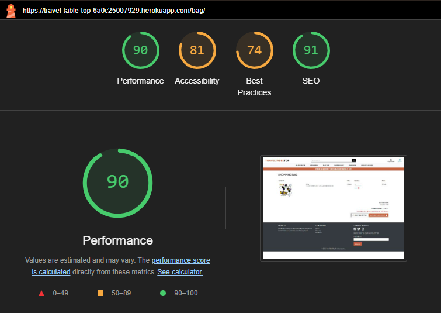

# Travel Table Top - Testing

This page contains all the testing details the website was run through.

## Code Validation

### HTML

I have used the recommended [HTML W3C Validator](https://validator.w3.org/) to validate all of my HTML files.

| Page | Screenshot | Result |
|------| ---------- | ------ |
| Home |  | PASS |
| Products |  | PASS |
| Product Detail | | PASS |
| Add a Product |  | PASS |
| Edit a Product |  | PASS |
| Profile |  | PASS |
| Bag |  | PASS |
| Checkout | | PASS |
| Checkout Success |  | PASS |
| Contact/FAQ |  | PASS |
| Signup | | PASS |
| Login |  | PASS |
| Logout || PASS |

### CSS

I have used the recommended [CSS Jigsaw Validator](https://jigsaw.w3.org/css-validator) to validate all of my CSS files.

| File | Screenshot | Result |
| ---- | ---------- | ------ |
| base.css | | PASS |
| checkout.css |  | PASS |
| profile.css |  | PASS |

### JavaScript

I have used the recommended [JShint Validator](https://jshint.com/) to validate all of my JS files.

| File | Screenshot | Result |
| ---- | ---------- | ------ |
| countryfield.js | | PASS |
| stripe_elements.js |  | Undefined variable |
| product.js |  | PASS |
| bag.js |  | PASS |

### Python

I used VS Code Extension Flake 8 to correct linting errors as and when I worked on my project. For the final test I used command `python -m flake8 --exclude .venv,.vscode,migrations` to test my python files. The auto generated code in ``settings.py`` and code in ``env.py`` was left as is

## Lighthouse Testing

| Page | Screenshot | Result |
| ---- | ---------- | ------ |
| Home Desktop |  | PASS |
| Home Mobile |  | PASS |
| Products Desktop |  | PASS |
| Products Mobile |  | PASS |
| Profile Desktop |  | PASS |
| Profile Mobile |  | PASS |
| Bag Desktop |  | PASS |
| Bag Mobile |  | PASS |
| Checkout  Desktop | | PASS |
| Checkout Mobile |  | PASS |
| Admin Desktop |  | PASS |
| Admin Mobile |   | PASS |

## Stripe 

- Order Created Successfully

- Stripe webhooks

- Stripe Events

