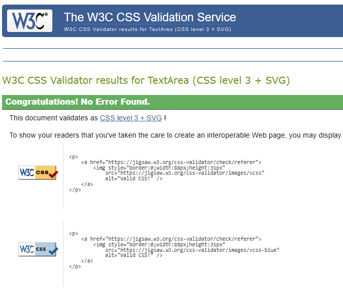
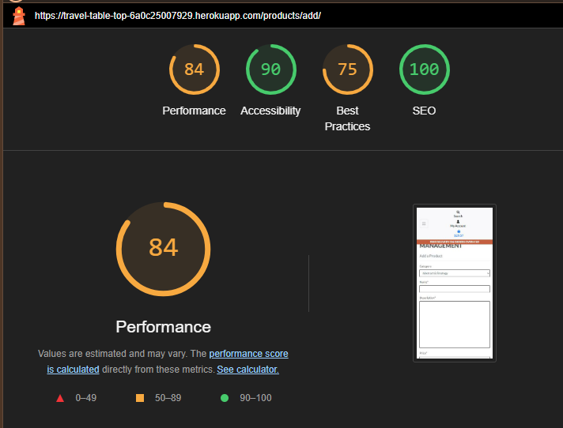

# Travel Table Top - Testing

This page contains all the testing details the website was run through.

## Code Validation

### HTML

I have used the recommended [HTML W3C Validator](https://validator.w3.org/) to validate all of my HTML files.

| Page | Screenshot | Result |
|------| ---------- | ------ |
| Home |  | PASS |
| Products |  | PASS |
| Product Detail | | PASS |
| Add a Product |  | PASS |
| Edit a Product |  | PASS |
| Profile |  | PASS |
| Bag |  | PASS |
| Checkout | | PASS |
| Checkout Success |  | PASS |
| Contact/FAQ |  | PASS |
| Signup | | PASS |
| Login |  | PASS |
| Logout || PASS |

### CSS

I have used the recommended [CSS Jigsaw Validator](https://jigsaw.w3.org/css-validator) to validate all of my CSS files.

| File | Screenshot | Result |
| ---- | ---------- | ------ |
| base.css | | PASS |
| checkout.css |  | PASS |
| profile.css |  | PASS |

### JavaScript

I have used the recommended [JShint Validator](https://jshint.com/) to validate all of my JS files.

| File | Screenshot | Result |
| ---- | ---------- | ------ |
| countryfield.js | | PASS |
| stripe_elements.js |  | Undefined variable |
| product.js |  | PASS |
| bag.js |  | PASS |

### Python

I used VS Code Extension Flake 8 to correct linting errors as and when I worked on my project. For the final test I used command `python -m flake8 --exclude .venv,.vscode,migrations` to test my python files. The auto generated code in ``settings.py`` and code in ``env.py`` was left as is

## Lighthouse Testing

| Page | Screenshot | Result |
| ---- | ---------- | ------ |
| Home Desktop |  | PASS |
| Home Mobile |  | PASS |
| Products Desktop |  | PASS |
| Products Mobile |  | PASS |
| Profile Desktop |  | PASS |
| Profile Mobile |  | PASS |
| Bag Desktop |  | PASS |
| Bag Mobile |  | PASS |
| Checkout  Desktop | | PASS |
| Checkout Mobile |  | PASS |
| Admin Desktop |  | PASS |
| Admin Mobile |   | PASS |

## Stripe 

- Order Created Successfully

- Stripe webhooks

- Stripe Events

## Manual Testing

### User Story Testing

#### Developer Stories

- [x] Frontend and Backend of the Project
- [x] Implementing AWS for image storage and postgres for database
- [x] Deployment on Heroku and setting secret keys

#### User Stories

- [x] Register/Login
- [x] View Site Products
- [x] View Product Detail
- [x] Search products on age, category, price, name
- [x] Create an Account
- [x] Update Profile details
- [x] Buy Games easily
- [x] Contact Admin of the Website
- [x] Easy Checkout
- [x] Subscribe to newsletter
- [x] View Previous order details

#### Admin Stories

- [x] Add/Update new games
- [x] Delete Games

### Testing Devices

Testing was performed on:

- Laptop

  - Lenovo Yoga 9

- Desktop Screen

  - 29 inch ViewSonic Screen (4k Monitor)

- Browsers
  - Google Chrome

### Manual Feature Tests

| Section        | Test Action                                           | Expected Result                                     | Pass/Fail |
| -------------- | ----------------------------------------------------- | --------------------------------------------------- | --------- |
| Navbar         | Click on Logo in Navbar                               | Redirect to Home                                    | Pass      |
|                | Click on All Games in Navbar                    | Redirect to Products Page   | Pass      |
|                | Click on Categories link in Navbar              | Opens a dropdown with different categories           | Pass      |
|                | Click on My Account in Navbar   | Opens a dropdown with Register and Login options         | Pass      |
|                | Click on Register Page on Navbar                      | Redirect to Signup Page                           | Pass      |
|                | Click on Login in My Account                        | Redirect to Login Page                    | Pass      |
|                | Click on ContactUs/FAQ on Navbar         | Redirect to ContactUs and FAQs page        | Pass      |
|                | Click on Account (Logged in) on Navbar   | Opens a dropdown with My profile/Sign-out Page      | Pass      |
|    | Click on basket in Navbar | Redirects to shopping bag with product details or message if no product | PASS |
| Search         | Add card/dice or game names              | Display games based on query                      | Pass      |
| Products Page | Click on sort by - name/category/price | Games are sorted based on the query | PASS |
|    | Click on a game | Opens Product Detail page | PASS |
| Product Detail | Click on Add to Bag | Product added to bag with Toast Success basket preview | PASS |
|  | Input quantity number and Add to Bag | Specified quantity of products added to bag | PASS |
| | Click on Keep Shopping Button | Redirect to Products Page | PASS |
| Shopping Bag | Increase/Decrease quantity of the product using input box and click update | Updated quantity reflected in total price and toast success shown | PASS |
| | Click on delete icon | The game is removed from the bag | PASS |
|  | Click on keep shopping button | Redirects to Products page | PASS |
|  | CLick on secure checkout button |  Redirects to checkout page | PASS
| Checkout | Click on Adjust Bag | Redirects to shopping bag page | PASS |
|  | Add details and click on complete order | Shows a spinner and then redirects to checkout success | PASS |
| | Click on check out latest games | Redirects to products page | PASS |
| Profile | Click on My Profile from My Account | Redirects to profile page | PASS |
| | update details and click update | Details updated showing a toast message | PASS |
| | Click on order number from the history | redirects to checkout success with order details and toast alert message |PASS |
| Product Management | Add details of a new product and click on Add Product | Redirects to product detail of a new product | PASS |
| | Click on Edit in the product detail page or products page | redirects to product management with pre-filled details on the product | PASS |
| | Click on delete product | Product is deleted | PASS |

## BUGS

There were a few bugs encountered during the development of the project. The bugs are listed and updated in the 
[Travel Table Top Project Board](https://github.com/users/hennasingh/projects/8)

| BUG | STATUS |
| --- | ------ |
| [Bug:42 - Update not working in Mobile View](https://github.com/hennasingh/TravelTableTop/issues/42) | Closed |
| [Bug:41 - Toast Error message displayed after successful registration](https://github.com/hennasingh/TravelTableTop/issues/41) | Closed |
| [Bug:36 -Checkout page throws data error on large quantities](https://github.com/hennasingh/TravelTableTop/issues/36) | Closed |
| [Bug:34 - Product Detail with integer id throws error](https://github.com/hennasingh/TravelTableTop/issues/34) | Closed |
| [Bug:22 -Quantity not updated when updated from bag page](https://github.com/hennasingh/TravelTableTop/issues/22) | Closed |